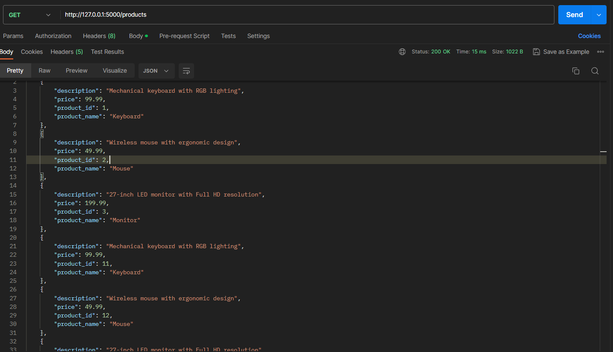
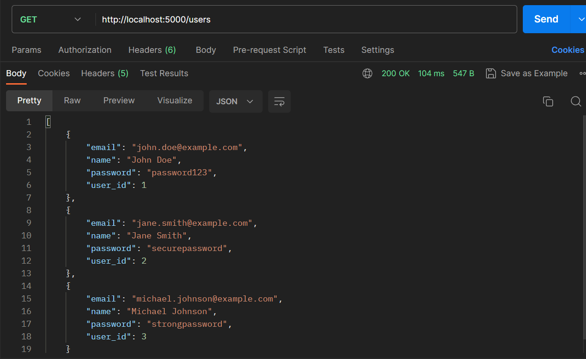
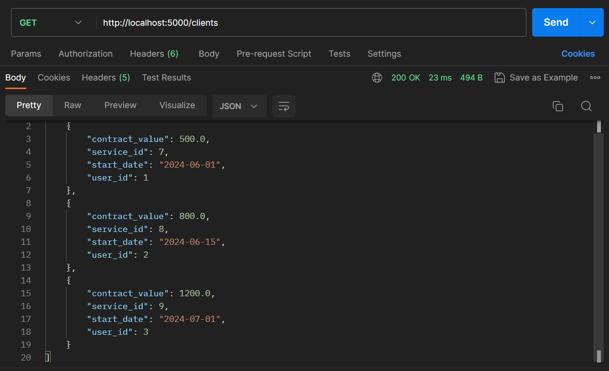
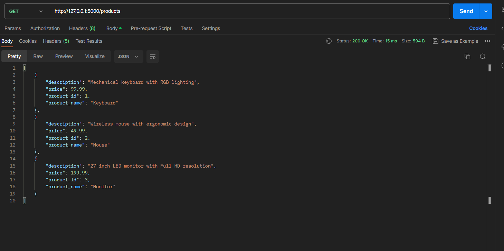

Take Home Test Arka

# Flask MySQL API

Proyek ini adalah aplikasi web sederhana menggunakan Flask yang terhubung ke database MySQL dan menyediakan endpoint API untuk mengambil data dari berbagai tabel.

## Fitur

- **Get Products**: Mengambil semua produk dari tabel `Products`.
- **Get Users**: Mengambil semua pengguna dari tabel `Users`.
- **Get Clients**: Mengambil semua klien dari tabel `Clients`.
- **Delete Duplicates**: Menghapus entri duplikat dari tabel `Products`.

## Prasyarat

- Python 3.x
- Flask
- MySQL
- mysql-connector-python

## Instalasi

1. **Klon repository**:

   ```sh
   git clone https://github.com/yourusername/your-repo.git
   cd your-repo
   ```

2. **Instal paket Python yang diperlukan**:

   ```sh
   pip install Flask mysql-connector-python
   ```

3. **Atur database MySQL**:

   - Pastikan server MySQL berjalan.
   - Buat database dengan nama `company`.
   - Buat tabel yang diperlukan (`Products`, `Users`, dan `Clients`).

4. **Perbarui detail koneksi database** di `App.py` jika diperlukan:
   ```python
   mydb = mysql.connector.connect(
       host="localhost",
       user="root",
       password="yourpassword",
       database="company"
   )
   ```

## Menjalankan Aplikasi

1. **Mulai aplikasi Flask**:

   ```sh
   python App.py
   ```

2. **Akses endpoint API**:
   - Get Products: `http://localhost:5000/products`
   - Get Users: `http://localhost:5000/users`
   - Get Clients: `http://localhost:5000/clients`

## Endpoint API

### Get Products

- **URL**: `/products`
- **Metode**: `GET`
- **Respons**:
  ```json
  [
      {
          "product_id": 1,
          "product_name": "Product A",
          "description": "Deskripsi Produk A",
          "price": 10.0
      },
      ...
  ]
  ```

### Get Users

- **URL**: `/users`
- **Metode**: `GET`
- **Respons**:
  ```json
  [
      {
          "user_id": 1,
          "name": "User A",
          "email": "usera@example.com",
          "password": "hashed_password"
      },
      ...
  ]
  ```

### Get Clients

- **URL**: `/clients`
- **Metode**: `GET`
- **Respons**:
  ```json
  [
      {
          "service_id": 1,
          "user_id": 1,
          "start_date": "2023-01-01T00:00:00",
          "contract_value": 1000.0
      },
      ...
  ]
  ```

### Delete Duplicates

- **Fungsi**: Menghapus entri duplikat dari tabel `Products` saat aplikasi Flask dimulai.

---

Apakah ada perubahan atau detail tambahan yang ingin Anda sertakan dalam file README ini?

---

Request Body

```json
http://127.0.0.1:5000/products
```

Response Body
Product

```json
[
  {
    "description": "Mechanical keyboard with RGB lighting",
    "price": 99.99,
    "product_id": 1,
    "product_name": "Keyboard"
  },
  {
    "description": "Wireless mouse with ergonomic design",
    "price": 49.99,
    "product_id": 2,
    "product_name": "Mouse"
  },
  {
    "description": "27-inch LED monitor with Full HD resolution",
    "price": 199.99,
    "product_id": 3,
    "product_name": "Monitor"
  },
  {
    "description": "Mechanical keyboard with RGB lighting",
    "price": 99.99,
    "product_id": 11,
    "product_name": "Keyboard"
  },
  {
    "description": "Wireless mouse with ergonomic design",
    "price": 49.99,
    "product_id": 12,
    "product_name": "Mouse"
  },
  {
    "description": "27-inch LED monitor with Full HD resolution",
    "price": 199.99,
    "product_id": 13,
    "product_name": "Monitor"
  }
]
```


Request Body

```json
http://127.0.0.1:5000/users
```

Response Body
Users

```json
[
  {
    "email": "john.doe@example.com",
    "name": "John Doe",
    "password": "password123",
    "user_id": 1
  },
  {
    "email": "jane.smith@example.com",
    "name": "Jane Smith",
    "password": "securepassword",
    "user_id": 2
  },
  {
    "email": "michael.johnson@example.com",
    "name": "Michael Johnson",
    "password": "strongpassword",
    "user_id": 3
  }
]
```


Request Body

```json
http://127.0.0.1:5000/clients
```

Response Body
Clients

```json
[
  {
    "contract_value": 500.0,
    "service_id": 7,
    "start_date": "2024-06-01",
    "user_id": 1
  },
  {
    "contract_value": 800.0,
    "service_id": 8,
    "start_date": "2024-06-15",
    "user_id": 2
  },
  {
    "contract_value": 1200.0,
    "service_id": 9,
    "start_date": "2024-07-01",
    "user_id": 3
  }
]
```



Request Body

```json
http://127.0.0.1:5000/products
```

Response Body
Setelah melakukan duplicate dengan function Python pada tabel product sudah dihapus

```json
[
  {
    "description": "Mechanical keyboard with RGB lighting",
    "price": 99.99,
    "product_id": 1,
    "product_name": "Keyboard"
  },
  {
    "description": "Wireless mouse with ergonomic design",
    "price": 49.99,
    "product_id": 2,
    "product_name": "Mouse"
  },
  {
    "description": "27-inch LED monitor with Full HD resolution",
    "price": 199.99,
    "product_id": 3,
    "product_name": "Monitor"
  }
]
```


